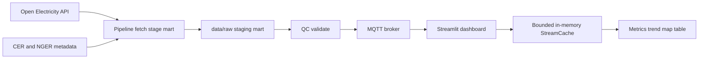

# Maintained NEM Data Pipeline with QC and Live Monitoring

Python project that maintains a National Electricity Market data pipeline with structured QC gates, layered CSV artifacts, MQTT publishing, and a Streamlit dashboard that consumes the live stream. The pipeline is the primary maintained surface; the dashboard is the downstream consumer.

## Portfolio Highlights

This project is designed to demonstrate maintained data-engineering workflow plus live monitoring:

- **Maintained pipeline**: Bash CLI entry point (`scripts/run_pipeline.sh`) for reproducible multi-stage runs with fail-fast stage gates
- **Data QC**: automated pass/fail checks with JSON/Markdown/HTML reports and run-level manifest metadata
- **Layered artifacts**: multi-source ingestion (Open Electricity API + CER/NGER metadata), deterministic cleaning/alignment (`raw` → `staging` → `mart`)
- **Streaming architecture**: MQTT pub/sub with bounded in-memory cache, reconnect monitoring, and optional disk snapshot persistence
- **Interactive dashboard**: Streamlit UI with custom Leaflet map component, live metrics, filters, and operational controls
- **Engineering quality**: Ruff lint/format, pytest coverage (fixture + tracked-data QC tests), GitHub Actions CI, Docker Compose demo, and Render deployment support

### Live Demo

- Deploy the dashboard to [Render](https://render.com) using `render.yaml`
- Start the MQTT publisher via GitHub Actions (`publish-mqtt-on-demand.yml`) or a self-hosted broker
- Point the dashboard at your broker with `MQTT_BROKER`, `MQTT_PORT`, and optional TLS credentials

### One-Command Local Demo

```bash
chmod +x scripts/start_local.sh
./scripts/start_local.sh
```

This builds and starts Mosquitto, the publisher, and the dashboard. Open `http://127.0.0.1:8501`.

On macOS without Docker Desktop, start [Colima](https://github.com/abiosoft/colima) first (`colima start`), then run the script above. See [docs/DEVELOPMENT.md](docs/DEVELOPMENT.md#local-docker-with-colima-macos) for the full Colima setup guide.

For interview talking points and a project walkthrough script, see [docs/PORTFOLIO.md](docs/PORTFOLIO.md).

### Pipeline + QC (recommended)

```bash
chmod +x scripts/run_pipeline.sh
./scripts/run_pipeline.sh
```

This runs `fetch → stage → mart → validate`, writes `reports/qc_latest.{json,md,html}`, and exits non-zero on QC failure. See [docs/RUNBOOK.md](docs/RUNBOOK.md).

Validate existing artifacts only:

```bash
python scripts/validate_mart.py
```

## Key Features

- Bash pipeline CLI with validate gate before optional publish
- Structured QC reports and run manifest (`reports/qc_latest.json`, `reports/manifest_latest.json`)
- Open Electricity API ingestion for operational electricity data
- CER and NGER facility metadata ingestion and matching
- Deterministic cleaning and staging into `data/raw/`, `data/staging/`, `data/mart/`, and `data/cache/`
- MQTT publish/subscribe flow using `comp5339/task123/measurements/{facility_code}`
- Streamlit dashboard with a custom facility map component, summary cards, filters, and a cache reset action
- Optional disk snapshot persistence for the bounded MQTT stream cache
- Ruff-based formatting and lint checks for low-cost style and error detection
- GitHub Actions CI plus optional on-demand publisher workflow for hosted deployments
- Lightweight tests for the dashboard and dotenv loader

## Tech Stack

- Python 3.10+
- Streamlit
- Pandas and NumPy
- Paho MQTT
- Requests
- Folium and `streamlit-folium`
- Docker Compose for the local Mosquitto broker

## Repository Structure

- `app/streamlit_app.py`: Streamlit wrapper entrypoint
- `scripts/run_pipeline.sh`: pipeline CLI (`fetch → stage → mart → validate`)
- `scripts/validate_mart.py`: QC-only entrypoint
- `scripts/run_publisher.py`: legacy publisher wrapper entrypoint
- `src/publisher/`: fetch, clean, align, QC, and publish data
- `src/dashboard/`: runtime state, MQTT subscriber, and Streamlit rendering
- `src/shared/`: shared dotenv, config, paths, topics, and stream cache helpers
- `broker/`: Mosquitto configuration and runtime volumes
- `Dockerfile` and `docker-compose.yml`: one-command local full stack
- `data/`: tracked sample artifacts plus generated pipeline outputs
- `docs/`: architecture, configuration, deployment, and troubleshooting notes
- `tests/`: logic tests for the dashboard, publisher, and pipeline smoke coverage

## Architecture



The runtime flow is:

1. `src/__init__.py` loads a repo-root `.env` file if one exists.
2. `./scripts/run_pipeline.sh` (or `python -m src.publisher.pipeline`) builds artifacts and runs QC before optional publish.
3. `scripts/run_publisher.py` remains a legacy path that publishes without an automatic QC gate.
4. `app/streamlit_app.py` calls `src.dashboard.app.main()`.
5. The dashboard subscribes to MQTT, stores accepted messages in a bounded `StreamCache`, and renders from the latest cached snapshot.

## Runbook

### 1. Start

If you use Colima on macOS, run `colima start` before any `docker compose` command. See [docs/DEVELOPMENT.md](docs/DEVELOPMENT.md#local-docker-with-colima-macos).

**Option A: Docker Compose full stack (recommended for demos)**

```bash
docker compose up --build
```

**Option B: Manual local setup**

Create a virtual environment, then install dependencies.

```bash
python3 -m venv .venv
source .venv/bin/activate
pip install -r requirements.txt
```

Configure environment variables in your shell or in a repo-root `.env` file.

The code loads `.env` automatically when `src` is imported, so you do not need a separate dotenv loader.

Copy `.env.example` as a starting point if you want a full list of supported variables and defaults.

Start the local MQTT broker.

```bash
docker compose up -d
```

Start the publisher in one terminal:

```bash
python scripts/run_publisher.py
```

Start the dashboard in a second terminal:

```bash
streamlit run app/streamlit_app.py
```

Open `http://127.0.0.1:8501`.

### 2. Verify

Run the low-cost checks first:

```bash
ruff format --check .
ruff check .
pytest -q
```

If you want a narrower smoke pass while iterating on the main flow, run:

```bash
pytest -q tests/test_pipeline_smoke.py tests/test_dashboard_logic.py tests/test_dotenv_loader.py
```

## Configuration

See [docs/CONFIGURATION.md](docs/CONFIGURATION.md) for the full environment variable matrix.

The most important values are:

- `MQTT_BROKER` / `MQTT_PORT` and the legacy `MQTT_BROKER_HOST` / `MQTT_BROKER_PORT` aliases
- `MQTT_SUBSCRIBE_TOPIC_FILTER` and `MQTT_PUBLISH_TOPIC_TEMPLATE`
- `OPEN_ELECTRICITY_API_KEY`
- `PUBLISH_DURATION_SECONDS`
- `FACILITY_METADATA_DATA_DIR`
- `MAX_STREAM_ROWS` and `RESET_INTERVAL_HOURS`
- `MAIN_REFRESH_INTERVAL_SECONDS` and `SIDEBAR_REFRESH_INTERVAL_SECONDS`
- `ENABLE_GITHUB_ACTIONS_CONTROL`, `AUTO_START_PUBLISHER`, and `AUTO_START_COOLDOWN_SECONDS`

## External Dependency Boundaries

- MQTT broker: if the broker is unavailable, the publisher cannot deliver live rows and the dashboard stays disconnected. The dashboard can still render its current in-memory cache until that cache is cleared or the process restarts.
- Open Electricity API: if the API key is missing or the remote API is unreachable, the publisher cannot rebuild fresh raw Open Electricity artifacts. If `data/mart/data_for_publish.csv` already exists, the publisher can keep replaying that file.
- CER and NGER sources: if the CER/NGER downloads are unavailable, the publisher cannot rebuild the facility metadata layer. Existing staged files can still be reused until they are deleted.
- Streamlit: if the dashboard process restarts, the in-memory stream cache is lost because the current UI state is not persisted to disk.
- GitHub Actions API: workflow controls are optional. If `ENABLE_GITHUB_ACTIONS_CONTROL=true` but `GITHUB_TOKEN` is missing or invalid, the sidebar controls fail closed and the rest of the dashboard remains usable.

### 3. Troubleshoot

- Confirm Mosquitto is running with `docker compose ps`.
- Confirm the publisher is running and writing to `comp5339/task123/measurements/{facility_code}`.
- If the dashboard shows disconnected, verify `MQTT_BROKER` and `MQTT_PORT` point to the broker you actually started.
- If the dashboard stays empty, confirm the publisher has generated `data/mart/data_for_publish.csv` and that the current cache is not stale.
- If you need a clean rebuild, remove the generated CSV and JSON artifacts under `data/` before restarting the publisher.

## Deployment Notes

- `docker-compose.yml` starts Mosquitto, the publisher, and the dashboard as a local full stack.
- `render.yaml` deploys the Streamlit frontend as a web service.
- The cloud dashboard is frontend-only; live data still depends on an MQTT broker.
- GitHub Actions control is optional and only works when `ENABLE_GITHUB_ACTIONS_CONTROL=true` and `GITHUB_TOKEN` is configured.

## Known Limitations

- The publisher reuses `data/mart/data_for_publish.csv` if it already exists.
- When the publisher must rebuild raw Open Electricity artifacts, it uses the fetch window from `FETCH_DATE_START` / `FETCH_DATE_END` (see `src/shared/config.py`).
- The dashboard keeps live state in memory; it does not persist a durable event history.
- Several features depend on external services; see the boundary notes above for the failure mode of each one.

## Docs

- [docs/RUNBOOK.md](docs/RUNBOOK.md)
- [docs/QC_RULES.md](docs/QC_RULES.md)
- [docs/ARCHITECTURE.md](docs/ARCHITECTURE.md)
- [docs/CONFIGURATION.md](docs/CONFIGURATION.md)
- [docs/DEVELOPMENT.md](docs/DEVELOPMENT.md)
- [docs/DEPLOYMENT.md](docs/DEPLOYMENT.md)
- [docs/TROUBLESHOOTING.md](docs/TROUBLESHOOTING.md)
- [docs/data_pipeline_and_missing_values.md](docs/data_pipeline_and_missing_values.md)
- [docs/LLM_ANALYTICS.md](docs/LLM_ANALYTICS.md)
