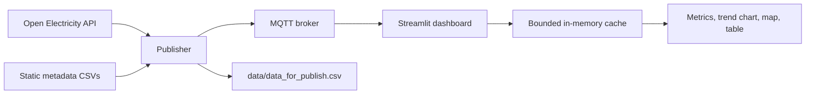

# NEM Monitoring Dashboard

Real-time monitoring stack for Australian NEM facilities built with Python, MQTT, and Streamlit. The project fetches electricity data, cleans and enriches it, publishes the result as a live MQTT stream, and renders an interactive dashboard with maps, charts, and tables.

## Why This Project

- End-to-end data pipeline from external API to live UI
- Clear missing-data policy and deterministic cleaning
- MQTT-based real-time delivery with confirmed publishes
- Resilient dashboard that keeps running while the broker is reconnecting
- Split local and cloud deployment paths that are easy to explain in interviews

## Architecture



The source of truth for the live UI is MQTT plus the in-memory cache, not a database. The publisher persists intermediate CSV artifacts under `data/` so runs are reproducible and easy to inspect.

## Repository Layout

- `src/publisher/`: data fetch, cleaning, alignment, and MQTT publishing
- `src/dashboard/`: MQTT subscriber, runtime state, filters, and render logic
- `src/shared/`: shared MQTT topics and cache helpers
- `app/streamlit_app.py`: Streamlit entrypoint used by local and hosted runs
- `scripts/run_publisher.py`: publisher entrypoint used by local runs and CI
- `docs/data_pipeline_and_missing_values.md`: deeper technical notes on the pipeline and cleaning policy
- `docs/deployment.md`: cloud/local deployment and operational details
- `tests/`: logic tests for publisher and dashboard behavior

## Quick Start

### 1. Create and activate a virtual environment

If the repository already has `.venv`, you can use it directly:

```bash
source .venv/bin/activate
```

Or create a fresh environment:

```bash
python3 -m venv .venv
source .venv/bin/activate
```

### 2. Install dependencies

```bash
pip install -r requirements.txt
```

### 3. Start the local MQTT broker

```bash
docker compose up -d
```

### 4. Start the publisher

```bash
python scripts/run_publisher.py
```

If `data/data_for_publish.csv` already exists, the publisher reuses it. If it does not exist, the publisher rebuilds the data artifacts first.

### 5. Start the dashboard

Open a second terminal:

```bash
streamlit run app/streamlit_app.py
```

Then open `http://127.0.0.1:8501`.

## What the Dashboard Shows

- Top-line metrics for the current live snapshot
- A trend panel for the latest facility message
- An interactive map of facilities
- A filterable table of the current snapshot
- MQTT connection state and cache statistics in the sidebar

If MQTT is unavailable, the page stays up and shows the current connection state instead of crashing.

## Configuration

The most important environment variables are:

- `MQTT_BROKER` and `MQTT_PORT`
- `MQTT_TLS`, `MQTT_USERNAME`, and `MQTT_PASSWORD`
- `MQTT_SUBSCRIBE_TOPIC_FILTER`
- `MQTT_PUBLISH_TOPIC_TEMPLATE`
- `OPEN_ELECTRICITY_API_KEY`
- `MAX_STREAM_ROWS`
- `RESET_INTERVAL_HOURS`
- `ENABLE_GITHUB_ACTIONS_CONTROL`
- `AUTO_START_PUBLISHER`

See [docs/deployment.md](docs/deployment.md) for the full environment matrix and deployment notes.

## Testing

Run the main logic tests with:

```bash
pytest -q tests/test_dashboard_logic.py
```

## Demo Links

- Render: https://nem-monitoring-dashboard.onrender.com
- Streamlit Cloud: https://nem-monitoring-dashboard.streamlit.app

## Related Docs

- [docs/data_pipeline_and_missing_values.md](docs/data_pipeline_and_missing_values.md)
- [docs/deployment.md](docs/deployment.md)
