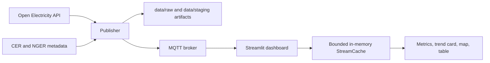

# NEM Monitoring Dashboard

Python project that fetches National Electricity Market related data, prepares publishable records, streams them over MQTT, and renders a Streamlit dashboard with a live map, metrics, and a table. The repository is structured as a small data pipeline plus a frontend that subscribes to the pipeline output.

## Key Features

- Open Electricity API ingestion for operational electricity data
- CER and NGER facility metadata ingestion and matching
- Deterministic cleaning and staging into `data/raw/`, `data/staging/`, and `data/mart/`
- MQTT publish/subscribe flow using `comp5339/task123/measurements/{facility_code}`
- Streamlit dashboard with a custom facility map component, summary cards, filters, and a cache reset action
- Optional GitHub Actions control for hosted deployments
- Lightweight tests for the dashboard and dotenv loader

## Tech Stack

- Python 3.10+
- Streamlit
- Pandas and NumPy
- Paho MQTT
- Requests
- Folium and `streamlit-folium`
- Docker Compose for the local Mosquitto broker

## Repository Structure

- `app/streamlit_app.py`: Streamlit wrapper entrypoint
- `scripts/run_publisher.py`: publisher wrapper entrypoint
- `src/publisher/`: fetch, clean, align, and publish data
- `src/dashboard/`: runtime state, MQTT subscriber, and Streamlit rendering
- `src/shared/`: shared dotenv, paths, topics, and stream cache helpers
- `broker/`: Mosquitto configuration and runtime volumes
- `data/`: tracked sample artifacts plus generated pipeline outputs
- `docs/`: architecture, configuration, deployment, and troubleshooting notes
- `tests/`: logic tests for the dashboard, publisher, and dotenv loader

## Architecture



The runtime flow is:

1. `src/__init__.py` loads a repo-root `.env` file if one exists.
2. `scripts/run_publisher.py` calls `src.publisher.cli.main()`.
3. The publisher prepares CSV artifacts when `data/mart/data_for_publish.csv` is missing, then streams rows as MQTT messages.
4. `app/streamlit_app.py` calls `src.dashboard.app.main()`.
5. The dashboard starts an MQTT client, stores accepted messages in a bounded `StreamCache`, and renders from the latest cached snapshot.

## Setup

1. Create a virtual environment.

```bash
python3 -m venv .venv
source .venv/bin/activate
```

2. Install dependencies.

```bash
pip install -r requirements.txt
```

3. Configure environment variables in your shell or in a repo-root `.env` file.

The code loads `.env` automatically when `src` is imported, so you do not need a separate dotenv loader.

4. Start the local MQTT broker.

```bash
docker compose up -d
```

## Run Locally

Start the publisher in one terminal:

```bash
python scripts/run_publisher.py
```

Start the dashboard in a second terminal:

```bash
streamlit run app/streamlit_app.py
```

Open `http://127.0.0.1:8501`.

## Configuration

See [docs/CONFIGURATION.md](docs/CONFIGURATION.md) for the full environment variable matrix.

The most important values are:

- `MQTT_BROKER` / `MQTT_PORT`
- `MQTT_SUBSCRIBE_TOPIC_FILTER`
- `MQTT_PUBLISH_TOPIC_TEMPLATE`
- `OPEN_ELECTRICITY_API_KEY`
- `MAX_STREAM_ROWS`
- `RESET_INTERVAL_HOURS`
- `ENABLE_GITHUB_ACTIONS_CONTROL`
- `AUTO_START_PUBLISHER`

## Testing

Run the repository tests with:

```bash
pytest -q tests/test_dashboard_logic.py tests/test_dotenv_loader.py
```

There is no separate lint or build command defined in `requirements.txt` or the repository scripts.

## Deployment Notes

- `docker-compose.yml` only starts Mosquitto. It does not start the Python services.
- `render.yaml` deploys the Streamlit frontend as a web service.
- The cloud dashboard is frontend-only; live data still depends on an MQTT broker.
- GitHub Actions control is optional and only works when `ENABLE_GITHUB_ACTIONS_CONTROL=true` and `GITHUB_TOKEN` is configured.

## Known Limitations

- The publisher reuses `data/mart/data_for_publish.csv` if it already exists.
- When the publisher must rebuild raw Open Electricity artifacts, it uses the hard-coded historical window visible in `src/publisher/cli.py`.
- The dashboard keeps live state in memory; it does not persist a durable event history.
- Several features depend on external services: the Open Electricity API, CER downloads, MQTT broker access, and optional GitHub Actions API access.

## Docs

- [docs/ARCHITECTURE.md](docs/ARCHITECTURE.md)
- [docs/CONFIGURATION.md](docs/CONFIGURATION.md)
- [docs/DEVELOPMENT.md](docs/DEVELOPMENT.md)
- [docs/DEPLOYMENT.md](docs/DEPLOYMENT.md)
- [docs/TROUBLESHOOTING.md](docs/TROUBLESHOOTING.md)
- [docs/data_pipeline_and_missing_values.md](docs/data_pipeline_and_missing_values.md)
