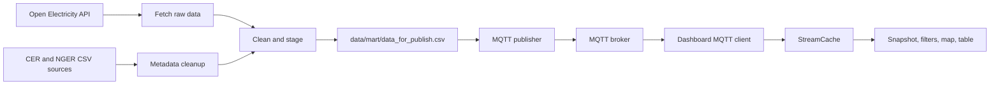

# Architecture

This repository is split into three runtime layers:

- `src/publisher/` fetches, cleans, aligns, and publishes data
- `src/dashboard/` subscribes to MQTT and renders the Streamlit UI
- `src/shared/` holds shared paths, topic names, dotenv loading, and cache utilities

## Runtime Entry Points

- `scripts/run_publisher.py` -> `src.publisher.cli.main()`
- `app/streamlit_app.py` -> `src.dashboard.app.main()`
- `src/__init__.py` loads a repo-root `.env` file when the package is imported

## Data Flow

## Publisher Flow

`src/publisher/cli.py` coordinates the publish pipeline:

1. Ensure the staged metadata files exist.
2. Fetch Open Electricity raw data when the cached raw files are missing.
3. Clean the facility list and consolidated data.
4. Join operational rows with cleaned facility metadata.
5. Write the publish-ready CSV to `data/mart/data_for_publish.csv`.
6. Enter the MQTT publish loop.

The publisher emits one JSON record per facility snapshot row. Messages are sent to:

- `comp5339/task123/measurements/{facility_code}`

The payload includes the facility identifier, location, state, fuel list, and the current operational metrics.

## Dashboard Flow

`src/dashboard/runtime/state.py` creates a singleton `DashboardRuntime` with:

- a bounded `StreamCache`
- an MQTT connection manager
- a background monitor that retries connections and performs soft resets

The MQTT client in `src/dashboard/runtime/mqtt.py` subscribes to:

- `comp5339/task123/measurements/#`

Accepted messages are normalized in `src/dashboard/data/normalization.py`, then aggregated into:

- the latest snapshot
- summary metrics
- the current trend card
- the map payload
- the preview table

## Rendering Model

`src/dashboard/render.py` renders the main page in two Streamlit fragments:

- the main fragment refreshes the metrics, trend card, map, and table
- the sidebar fragment refreshes connection state and control widgets

The map is rendered through a custom Streamlit component located at:

- `src/dashboard/components/nem_map_component_frontend/index.html`

## Data Artifacts

The pipeline uses layered on-disk artifacts:

- `data/raw/`: upstream extracts
- `data/staging/`: cleaned intermediate tables
- `data/mart/`: publish-ready output
- `data/cache/`: persisted publisher cache data

These files are generated by the pipeline and are not the application source of truth.
